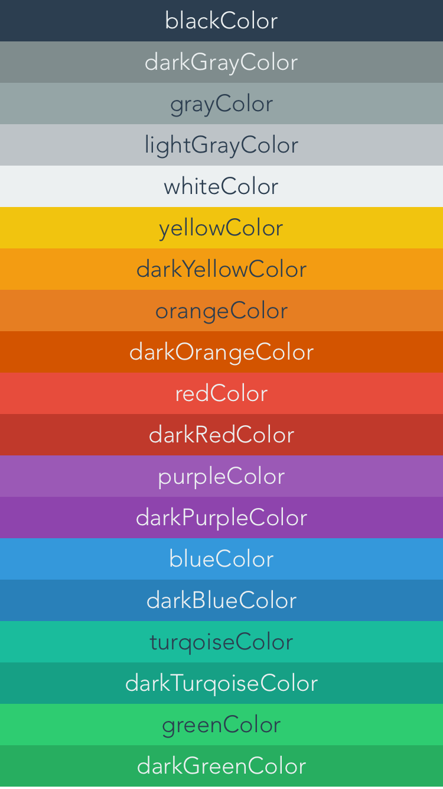

# FlatUIColor - UIColor+Flat
`UIColor+Flat` ia an Objective C category to override UIColor's standard colors with beautiful Flat UI ones.

All new colors are taken from [FlatUIColors.com](http://flatuicolors.com/).


There are some other classes available that will already grab these Flat UI colors, however, they all use the actual name of the color. eg. `[UIColor flatEmeraldColor]`. Which I have found to be difficult to remember, and also annoying to implement into a project already containing the standard `UIColor` methods.

*What makes this better...?*
You don’t have to do anything differently. Just add the files, and you are locked and loaded and ready to make stuff prettier!


## Usage
To use, just import `UIColor+Flat.m` and `UIColor+Flat.h` into your project, and use `UIColor` as you normally would.

``` objc
 self.view.backgroundColor = [UIColor redColor];
 ```


## Extra Colors
As well as overriding the stand UIColor methods. A few more colors such as `darkRedColor` have been added. Here is a full list of the colors.


## Bonus Methods
A few bonus methods exist in UIColor+Flat.

`- (UIColor *)contrastingColor;`
Will return either `[UIColor blackColor]` or `[UIColor whiteColor]`, depending on which color will contrast most. Great for finding the text color to use on a colored background. *(What I used to color the text in the previous image).*

`+ (UIColor *)colorFromHex:(UInt32)hex;`
Will return the color from a hex value, such as `0x2C3E50`.

`+ (UIColor *)colorFromHexString:(NSString*)hexString;`
Will return a color from a hex string, either `@"#2C3E50"` or `@"2C3E50"`.


## License
`UIColor+Flat` is released under the [MIT license](https://github.com/DWilliames/FlatUIColor/blob/master/LICENSE).
